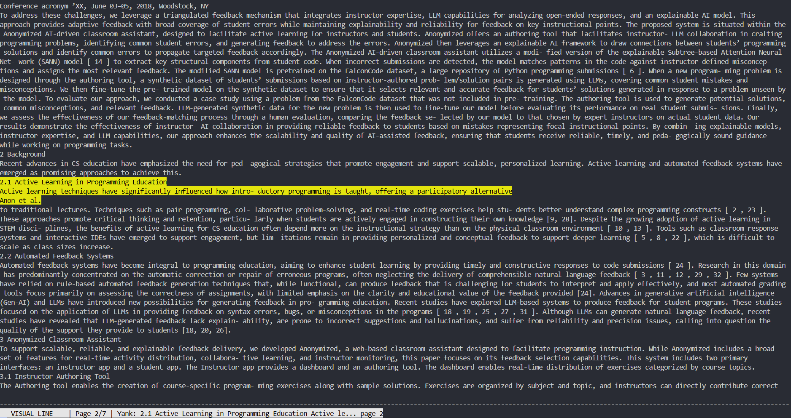

# PDFVim

A terminal-based PDF viewer with Vim-style navigation. Designed for researchers, power users, and keyboard users.

## Features

* Fast startup and navigation
* Visual mode, yank, and Vim commands (`j`, `k`, `gg`, `G`, `yy`, etc.)
* Two-column layout parsing (e.g., academic papers)
* Accurate text ordering: title, authors, then left column, then right column
* Search, jump, and page commands

## Demo



## Installation

Clone the repository:

```bash
git clone https://github.com/yourusername/pdfvim.git
cd pdfvim
pip install -r requirements.txt
```

## Usage

```bash
python main.py path/to/your/file.pdf
```

### Keyboard Controls

* `j` / `k` — Scroll up/down
* `h` / `l` — Scroll left/right
* `gg` / `G` — Jump to top/bottom
* `:q` — Quit
* `yy` — Yank current line
* Visual mode support (line, char)
* type ':help' for more 

## Dependencies

* PyMuPDF (`pip install PyMuPDF`)
* `curses` (built-in on Unix, install `windows-curses` for Windows)

## License

MIT License
